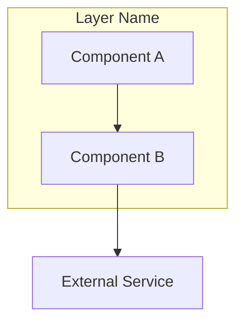
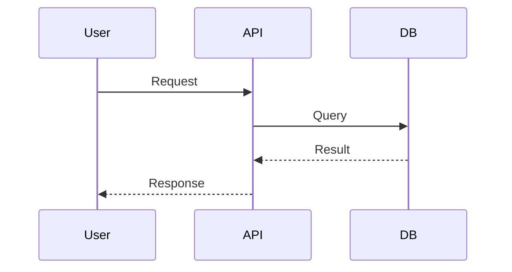
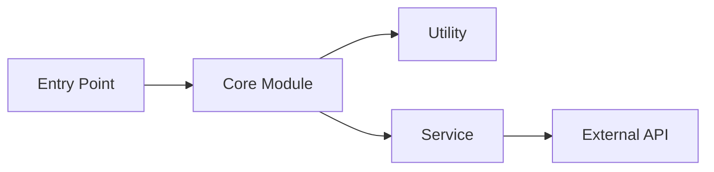

# Librarian Skill

Deep codebase exploration across local and remote repositories.

## How to Use This Skill

This skill provides decision trees and patterns for exploring codebases efficiently.

## Tool Arsenal

### Search Tools (Exa)

| Tool | Best For |
|------|----------|
| **codesearch** | Find code patterns, API examples, library internals, SDK documentation |
| **websearch** | Latest docs, tutorials, blog posts, comparisons, general information |

### Extraction Tools (Tavily)

| Tool | Best For |
|------|----------|
| **tavily_tavily_extract** | Get full content from specific URLs you already have |
| **tavily_tavily_crawl** | Crawl multiple pages from a documentation site |
| **tavily_tavily_map** | Discover site structure and find all URLs on a site |

### Local Tools

| Tool | Best For |
|------|----------|
| **grep** | Find patterns in local codebase |
| **glob** | Discover local file structure |
| **read** | Deep dive into specific files |

### When to Use Which

```
Need to find information?
├─ Code/API examples → codesearch (Exa)
├─ General docs/tutorials → websearch (Exa)
└─ Have specific URL → tavily_tavily_extract (Tavily)

Need to explore a documentation site?
├─ Know the URL → tavily_tavily_crawl (Tavily)
└─ Need to find pages → tavily_tavily_map (Tavily)

Working with local code?
├─ Find patterns → grep
├─ Find files → glob
└─ Read content → read
```

## Quick Decision Trees

### "How does X library work?"

```
Known library?
├─ Yes → codesearch("<library> <feature> implementation")
│   ├─ Found docs? → Read and synthesize
│   └─ Need source code? → codesearch("<library> source code <feature>")
└─ No/Obscure → websearch("<library> documentation")
    └─ Found docs URL? → tavily_tavily_extract(url)
```

### "Find implementations of pattern X"

```
Scope?
├─ Open source → codesearch("<pattern> implementation typescript")
├─ Local repo → grep(pattern) → read matches
└─ Specific library → codesearch("<library> <pattern> example")
```

### "Explore repository structure"

```
1. glob("**/*") to see file tree
2. read(README.md, package.json, src/index.*)
3. Identify entry points and main modules
4. Create architecture diagram if complex
```

### "Explore documentation site"

```
1. websearch("<library> documentation site")
2. tavily_tavily_map(docs_url) to discover all pages
3. tavily_tavily_extract(relevant_urls) for full content
4. Synthesize and create summary
```

### "Compare X vs Y"

```
1. codesearch for both: "<X> vs <Y> comparison"
2. codesearch for specific features in each
3. Read comparable implementation files
4. Synthesize differences in table format
```

### "Debug why library X behaves unexpectedly"

```
1. codesearch("<library> <behavior> source")
2. Find the specific function/module
3. Trace the code path
4. Check for edge cases or configuration
```

## Search Patterns

### Effective codesearch Queries

```
# API usage examples
"<library> <method> example typescript"

# Internal implementation
"<library> source <function> implementation"

# Configuration options
"<library> config options reference"

# Error handling
"<library> error handling <ErrorType>"

# Migration/upgrade
"<library> v2 migration guide"
```

### Effective websearch Queries

```
# Latest docs
"<library> official documentation 2024"

# Tutorials
"<library> tutorial getting started"

# Comparisons
"<library> vs <alternative> comparison"

# Troubleshooting
"<library> <error message> solution"
```

## Output Guidelines

1. **Comprehensive final message** - only last message returns to main agent
2. **Parallel tool calls** - maximize efficiency
3. **Link every file reference** - use GitHub URLs
4. **Diagram complex relationships** - use mermaid
5. **Never mention tool names** - say "I'll search" not "I'll use codesearch"

## GitHub Linking Patterns

When referencing code, use fluent linking:

| Type | Format |
|------|--------|
| File | `[filename](https://github.com/{owner}/{repo}/blob/{ref}/{path})` |
| Lines | `[code](https://github.com/{owner}/{repo}/blob/{ref}/{path}#L{start}-L{end})` |
| Directory | `[folder](https://github.com/{owner}/{repo}/tree/{ref}/{path})` |

## Mermaid Diagram Patterns

### Architecture Overview



### Data Flow



### Module Dependencies



## Example Exploration Session

**Query:** "How does Zustand handle state updates internally?"

**Process:**
1. `codesearch("zustand setState implementation source")` → Find core logic
2. Read the store creation and setState functions
3. Trace subscription mechanism
4. Create diagram showing update flow
5. Summarize with links to key files

**Output:**
```markdown
## Zustand State Update Flow

Zustand uses a pub-sub pattern with batched updates...

### Key Files
- [vanilla.ts](https://github.com/pmndrs/zustand/blob/main/src/vanilla.ts#L20-L45) - Core store creation
- [react.ts](https://github.com/pmndrs/zustand/blob/main/src/react.ts) - React bindings

### Flow Diagram
[mermaid diagram here]

### Key Insights
1. State is stored in a closure
2. Subscribers are notified synchronously
3. React binding uses useSyncExternalStore
```
